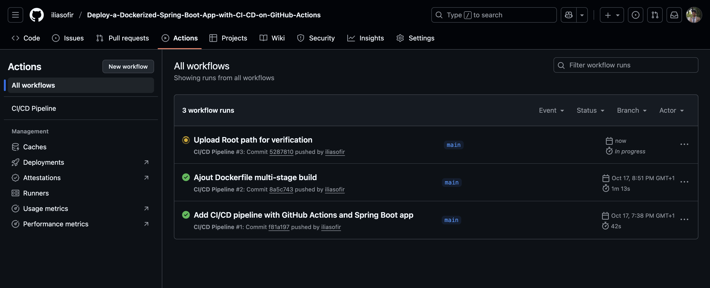
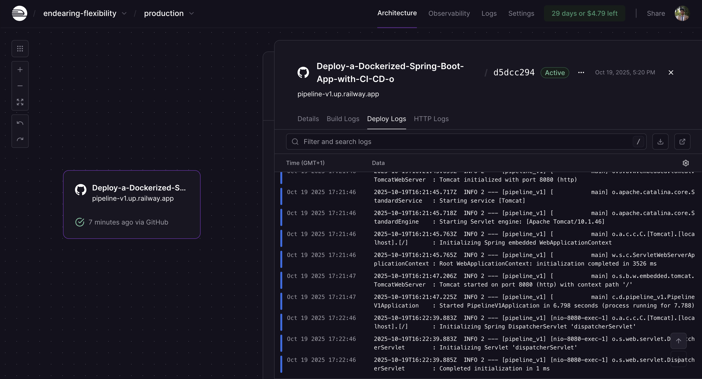
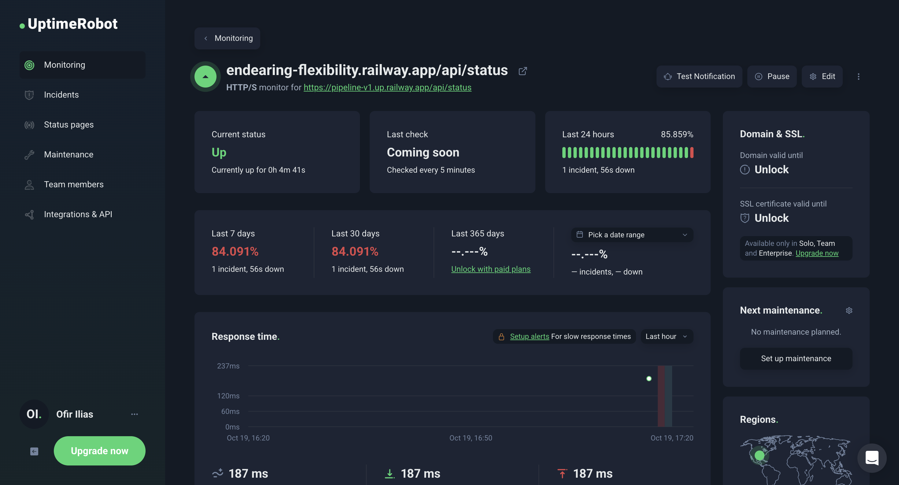

# DevOps CI/CD Pipeline with Spring Boot, Railway & UptimeRobot


---

## 📋 Project Overview

This project demonstrates a complete **DevOps CI/CD pipeline** for a Spring Boot application with automated building, containerization, cloud deployment, and monitoring. It showcases modern DevOps practices including continuous integration, continuous deployment, containerization, and proactive monitoring.

### 🎯 Key Objectives

- ✅ Implement automated CI/CD pipeline with GitHub Actions
- ✅ Containerize application using Docker best practices
- ✅ Deploy to Railway cloud platform with zero-downtime
- ✅ Monitor application health 24/7 with UptimeRobot
- ✅ Ensure production-ready deployment workflow

---

## 🏗️ Pipeline Architecture


The pipeline follows a three-stage automated workflow:

### 1. **Source Control & CI** (GitHub Actions)
Automated build triggered on every push to main branch, running tests, building artifacts, and creating Docker images.

### 2. **Deployment** (Railway)
Seamless deployment to cloud infrastructure with automatic container orchestration and HTTPS endpoint provisioning.

### 3. **Monitoring** (UptimeRobot)
Continuous health checks with instant alerting to ensure high availability and quick incident response.

---

## 🚀 Technology Stack

| Technology         | Version | Purpose                                  |
|--------------------|---------|------------------------------------------|
| **Java**           |  17     | Runtime environment                      |
| **Spring Boot**    | 3.5.6   | Application framework                    |
| **Maven**          | Latest  | Build automation & dependency management |
| **Docker**         | Latest  | Application containerization             |
| **GitHub Actions** | Latest  | CI/CD automation                         |
| **Railway**        | Cloud   | PaaS deployment platform                 | 
| **UptimeRobot**    | Cloud   | Application monitoring & alerting        |

---

## ⚙️ Pipeline Workflow

### Step 1: Continuous Integration (GitHub Actions)



**Triggered by:** Push to `main` branch

**Workflow steps:**
1. Checkout source code from repository
2. Configure Java 17 environment
3. Execute Maven build (`mvn clean package`)
4. Run unit and integration tests
5. Build Docker image with optimized layers
6. Push image to container registry (optional)

**Configuration file:** `.github/workflows/build.yml`

### Step 2: Continuous Deployment (Railway)



**Deployment process:**
- Railway automatically detects `Dockerfile` in repository
- Builds container image in cloud environment
- Deploys to managed infrastructure
- Assigns public HTTPS URL with SSL certificate
- Handles dynamic port binding via `PORT` environment variable

**Live Application:** `https://your-app.up.railway.app`

**Key features:**
- Automatic SSL/TLS certificates
- Zero-downtime deployments
- Environment variable management
- Automatic restarts on failure

### Step 3: Application Monitoring (UptimeRobot)



**Monitoring configuration:**
- **Check frequency:** Every 5 minutes
- **Endpoint:** `https://your-app.up.railway.app/api/health`
- **Success criteria:** HTTP 200 + Response contains `"status": "UP"`
- **Alerts:** Email notifications on downtime
- **Metrics:** Uptime percentage, response time, incident history

---

## 🌐 API Endpoints

| Endpoint | Method | Description | Response Example |
|----------|--------|-------------|------------------|
| `/api/hello` | GET | Welcome message | `{"message": "Hello from DevOps Pipeline!"}` |
| `/api/status` | GET | Application status & metadata | `{"status": "running", "version": "1.0.0"}` |
| `/api/health` | GET | Health check for monitoring | `{"status": "UP", "timestamp": "2025-10-19T..."}` |

---

## 🔧 Getting Started

### Prerequisites

- **Java 17** or higher
- **Maven 3.6+**
- **Docker** (for containerization)
- **Git** (for version control)

### Local Development

```bash
# Clone the repository
git clone https://github.com/YOUR_USERNAME/YOUR_REPO.git
cd YOUR_REPO

# Build the application
mvn clean package

# Run locally
java -jar target/pipeline_v1-0.0.1-SNAPSHOT.jar

# Access application
curl http://localhost:8080/api/hello
```

### Docker Deployment

```bash
# Build Docker image
docker build -t devops-demo .

# Run container
docker run -p 8080:8080 -e PORT=8080 devops-demo

# Test container
curl http://localhost:8080/api/health
```

### Environment Variables

| Variable | Description | Default |
|----------|-------------|---------|
| `PORT` | Application port (Railway sets this automatically) | `8080` |
| `SPRING_PROFILES_ACTIVE` | Spring Boot active profile | `prod` |

---

## 📊 Setting Up Monitoring

### UptimeRobot Configuration

1. **Create account** at [uptimerobot.com](https://uptimerobot.com)
2. **Add new monitor:**
   - Monitor Type: HTTP(s)
   - URL: `https://your-app.up.railway.app/api/health`
   - Monitoring Interval: 5 minutes
3. **Configure keyword monitoring:**
   - Keyword: `"UP"`
   - Keyword type: Exists
4. **Set up alert contacts:**
   - Add email address
   - Configure notification threshold
5. **Enable status page** (optional) for public visibility

---

## 📁 Project Structure

```
.
├── .github/
│   └── workflows/
│       └── build.yml          # GitHub Actions CI/CD pipeline
├── src/
│   └── main/
│       ├── java/              # Application source code
│       └── resources/
│           └── application.properties
├── images/                    # Documentation images
├── Dockerfile                 # Container configuration
├── pom.xml                    # Maven dependencies
└── README.md                  # Project documentation
```

---

## 🔒 Best Practices Implemented

- ✅ **Multi-stage Docker builds** for optimized image size
- ✅ **Health check endpoints** for monitoring
- ✅ **Environment-based configuration** for flexibility
- ✅ **Automated testing** in CI pipeline
- ✅ **Graceful shutdown** handling
- ✅ **Logging and observability** ready

---

## 🐛 Troubleshooting

### Application won't start on Railway
- Ensure `PORT` environment variable is properly configured
- Check Railway logs for startup errors
- Verify Dockerfile builds locally

### UptimeRobot shows down
- Confirm `/api/health` endpoint returns `"status": "UP"`
- Check Railway deployment status
- Verify application is responding to health checks

### CI/CD pipeline fails
- Review GitHub Actions logs
- Ensure Maven build succeeds locally
- Check Java version compatibility

---

## 📈 Future Enhancements

- [ ] Add comprehensive test coverage (unit, integration, e2e)
- [ ] Implement database integration (PostgreSQL)
- [ ] Add Redis caching layer
- [ ] Integrate Prometheus + Grafana for metrics
- [ ] Implement blue-green deployment strategy
- [ ] Add API documentation with Swagger/OpenAPI
- [ ] Configure automated backups
- [ ] Add security scanning in CI pipeline

---

## 🤝 Contributing

Contributions are welcome! Please feel free to submit a Pull Request.

1. Fork the repository
2. Create your feature branch (`git checkout -b feature/AmazingFeature`)
3. Commit your changes (`git commit -m 'Add some AmazingFeature'`)
4. Push to the branch (`git push origin feature/AmazingFeature`)
5. Open a Pull Request

---

## 📝 License

This project is licensed under the MIT License - see the [LICENSE](LICENSE) file for details.

---

## 👤 Author

**Your Name**

- GitHub: [@YOUR_USERNAME](https://github.com/YOUR_USERNAME)
- LinkedIn: [Your LinkedIn](https://linkedin.com/in/yourprofile)
- Email: your.email@example.com

---

## 🙏 Acknowledgments

- Spring Boot team for the excellent framework
- Railway for providing seamless deployment experience
- UptimeRobot for reliable monitoring services
- The DevOps community for continuous inspiration

---

**⭐ If you find this project helpful, please consider giving it a star!**

**Built with enthusiasm for learning DevOps practices and modern cloud deployment workflows.**
